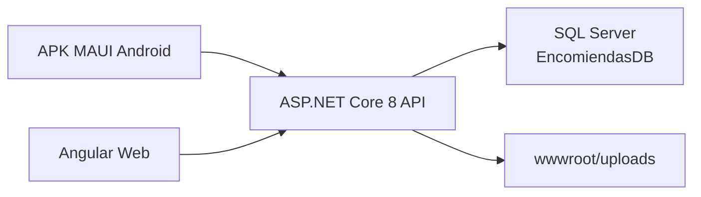
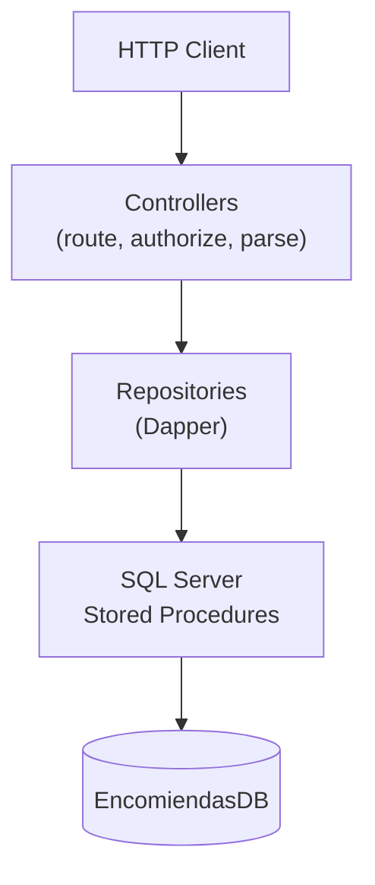
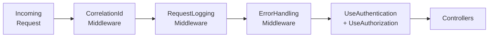

ServiciosYa API is an ASP.NET Core 8 REST API that acts as the central hub for authentication, authorization, business logic, and data persistence across the entire ServiciosYa logistics platform. Two client applications consume it — an Angular web portal used by internal staff and a .NET MAUI Android application aimed at end customers — both communicating over HTTPS using JWT Bearer tokens. All persistent state lives in a SQL Server database (`EncomiendasDB`), and uploaded files (payment proofs, service-request attachments) are stored on disk under `wwwroot/uploads` and served as static files by the same process.

## System diagram



<CardGroup cols={2}>
  <Card title="Angular Web Portal" icon="globe">
    Administrative and operational portal for internal roles. Handles login, dashboards, service management, request validation, payment review, and user administration.
  </Card>
  <Card title=".NET MAUI Android App" icon="mobile">
    Customer-facing app for public registration, login, service catalogue browsing, submitting service requests with payment proof, and tracking request status.
  </Card>
  <Card title="ASP.NET Core 8 API" icon="server">
    Central API. Enforces authentication, role-based authorization, and multi-tenancy. Delegates persistence to SQL Server via Dapper and stored procedures.
  </Card>
  <Card title="SQL Server EncomiendasDB" icon="database">
    Stores all entities — companies, users, services, service requests, payments, audit logs. Business rules are enforced in stored procedures called from Dapper repositories.
  </Card>
</CardGroup>

## API layer architecture

Every HTTP request travels through three logical tiers before touching the database.



| Tier | Responsibility |
|---|---|
| **Controllers** | Route resolution, `[Authorize]` enforcement, claim extraction via `BaseController`, DTO validation, and HTTP response shaping. |
| **Repositories (Dapper)** | Execute stored procedures or parameterized queries using `IDbConnectionFactory`. Each aggregate has its own scoped repository interface and implementation. |
| **Stored Procedures** | Contain most persistent business rules: role-hierarchy checks, status-transition guards, audit inserts, and multi-tenancy filters via `CompanyID`. |

<Note>
  `BaseController` exposes three protected helpers that controllers use to read identity claims from the JWT: `GetUserId()` → `int`, `GetCompanyId()` → `int`, and `GetUserRole()` → `string`. A fourth helper, `GetCorrelationId()`, returns the `Guid` placed in `HttpContext.Items` by `CorrelationIdMiddleware`.
</Note>

## Middleware pipeline

The pipeline is registered in `Program.cs` in the following order. Each middleware runs before authentication, so correlation tracking and structured logging are available even for unauthenticated requests and error responses.



<Steps>
  <Step title="CorrelationIdMiddleware">
    Reads the `X-Correlation-Id` request header. If the header is present and contains a valid `Guid`, that value is reused; otherwise a new `Guid` is generated. The resolved ID is stored in `HttpContext.Items` and echoed back in the `X-Correlation-Id` response header so clients can correlate logs with a specific request.
  </Step>
  <Step title="RequestLoggingMiddleware">
    Logs an `HTTP START` entry before the request proceeds and an `HTTP END` entry after the response completes, capturing method, path, correlation ID, user ID, company ID, HTTP status code, and elapsed milliseconds. It also feeds request counts and latency into `ISystemMetricsService` for the diagnostics dashboard.
  </Step>
  <Step title="ErrorHandlingMiddleware">
    Wraps the remaining pipeline in a `try/catch`. Converts `SqlException`, `UnauthorizedAccessException`, `InvalidOperationException`, and unhandled `Exception` into the standard JSON error envelope `{ success, data, error: { code, message } }`. When `Diagnostics:EnableDetailedErrors` is `false` (the default in production), internal details are suppressed and sensitive keywords (`password`, `token`, `authorization`) are redacted.
  </Step>
  <Step title="Authentication & Authorization">
    ASP.NET Core's built-in `UseAuthentication` validates the JWT Bearer token and populates `HttpContext.User`. `UseAuthorization` then enforces `[Authorize(Roles = "...")]` attributes on controllers.
  </Step>
  <Step title="Controllers">
    Matched routes are executed. Static files under `wwwroot/uploads` are served by `UseStaticFiles`, which runs after authorization in the pipeline.
  </Step>
</Steps>

## Dual URL routing

The API supports two URL schemes simultaneously so that existing mobile and web clients using legacy paths are not broken when new versioned endpoints are introduced.

| Scheme | Example |
|---|---|
| Legacy | `/api/auth/login` |
| Versioned | `/api/v1/auth/login` |

Both route patterns resolve to the same controller actions. The architecture document notes that all new endpoints should be added under `/api/v1/[controller]` while legacy paths remain active for backwards compatibility. Health endpoints (`/health/live`, `/health/ready`) are public and version-neutral.

## Static file serving

Uploaded files — payment proofs and optional service-request attachments — are written to the `wwwroot/uploads` directory on the API host and then served as static assets by ASP.NET Core's built-in static file middleware. The stored URL returned to clients is a relative path (e.g., `/uploads/payments/abc123.jpg`) that resolves directly against the API base URL.

<Warning>
  In the current setup, files are stored on the local disk of the API process. For a production deployment that scales horizontally or needs backup guarantees, plan to migrate `wwwroot/uploads` to external or network-attached storage before going live.
</Warning>

## Swagger UI

Swagger UI is registered via Swashbuckle and configured with a Bearer security scheme so developers can authenticate directly from the browser interface. It is **only enabled when the application runs in the `Development` environment** — it is not exposed in staging or production builds.

To access Swagger locally, start the API and navigate to:

```
https://localhost:7177/swagger
```

## Key dependencies

| Package | Version | Purpose |
|---|---|---|
| `Microsoft.AspNetCore` (ASP.NET Core 8) | 8.0.x | Web host, routing, middleware, DI |
| `Dapper` | 2.1.72 | Lightweight ORM for stored procedure calls |
| `Microsoft.Data.SqlClient` | 7.0.0 | SQL Server connection driver |
| `Microsoft.AspNetCore.Authentication.JwtBearer` | 8.0.0 | JWT Bearer token validation |
| `Swashbuckle.AspNetCore` | 6.6.2 | Swagger/OpenAPI documentation |

## Local development URLs

| Profile | URL |
|---|---|
| HTTPS (localhost) | `https://localhost:7177` |
| HTTP (localhost) | `http://localhost:5258` |
| LAN (physical device access) | `https://0.0.0.0:7177` |

The Angular web portal configures `environment.apiUrl` as `https://localhost:7177/api`. The MAUI app targets `https://10.0.2.2:7177/` on the Android emulator and `https://192.168.24.19:7177/` on a physical device.
