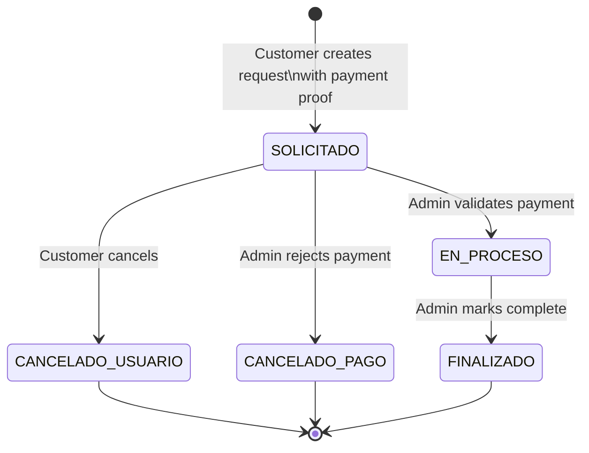
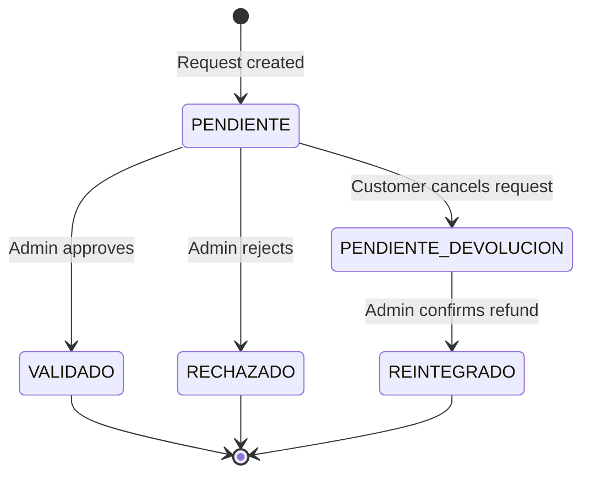
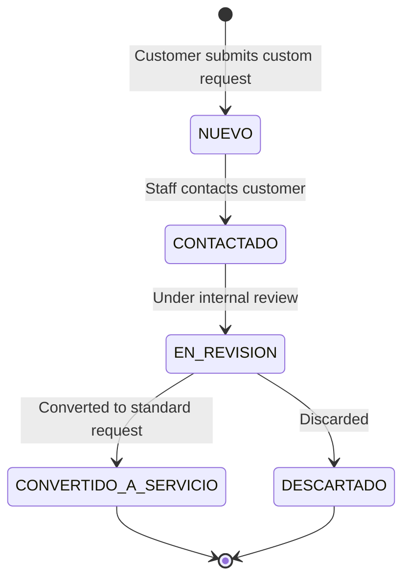

A service request in ServiciosYa is not a simple record — it is a coordinated pair of entities: the request itself (tracking progress toward service delivery) and a linked payment record (tracking the financial proof and its validation). Both entities advance through their own state machines in lockstep, driven by customer actions and administrator reviews. Understanding how these two state machines interact is essential for building correct integrations and troubleshooting stuck requests.

## Service request states



| State | Meaning |
|---|---|
| `SOLICITADO` | Request created and payment proof uploaded. Awaiting admin payment review. |
| `EN_PROCESO` | Payment validated by admin. Service is being delivered. |
| `FINALIZADO` | Service delivery complete. Terminal state. |
| `CANCELADO_USUARIO` | Customer cancelled the request while it was still in `SOLICITADO`. |
| `CANCELADO_PAGO` | Admin rejected the payment proof. Terminal state. |

<Note>
  State transitions are enforced by the `UpdateServiceRequestStatus` stored procedure in SQL Server. The API layer sends the new status and the procedure validates that the transition is permitted for the current state and the caller's role before applying it.
</Note>

## Payment states

Each service request has exactly one associated `ServiceRequestPayments` record. Its state mirrors — and often drives — the state of the parent request.

| Payment state | Meaning |
|---|---|
| `PENDIENTE` | Proof uploaded, awaiting admin review. Set automatically at request creation. |
| `VALIDADO` | Admin approved the proof. The request moves to `EN_PROCESO`. |
| `RECHAZADO` | Admin rejected the proof. The request moves to `CANCELADO_PAGO`. |
| `PENDIENTE_DEVOLUCION` | Customer cancelled. Refund is pending admin confirmation. |
| `REINTEGRADO` | Admin confirmed the refund has been returned to the customer. |



## Standard creation flow

The creation of a service request is a two-step process. The payment proof must be uploaded first to obtain its URL, which is then referenced in the request body.

<Steps>
  <Step title="Upload the payment proof">
    Send the image file as `multipart/form-data` to the uploads endpoint. The API writes the file to `wwwroot/uploads` and returns the relative URL.

    ```http
    POST /api/uploads/payment
    Authorization: Bearer <token>
    Content-Type: multipart/form-data

    [image file field]
    ```

    Response:
    ```json
    {
      "imageUrl": "/uploads/payments/abc123.jpg"
    }
    ```

    Maximum file size is **10 MB**.
  </Step>
  <Step title="Create the service request">
    Submit a request body that references the service and the proof URL returned in the previous step.

    ```http
    POST /api/servicerequests
    Authorization: Bearer <token>
    Content-Type: application/json

    {
      "serviceId": 42,
      "paymentImageUrl": "/uploads/payments/abc123.jpg"
    }
    ```

    The API calls `CreateServiceRequest` (stored procedure), which creates both the `ServiceRequests` row (state: `SOLICITADO`) and the `ServiceRequestPayments` row (state: `PENDIENTE`). The response includes the new `requestId`.
  </Step>
  <Step title="Admin reviews the payment proof">
    An admin user (role `SUPER_ADMIN`, `ADMIN_GENERAL`, or `GESTOR_SUPREMO`) reviews the uploaded proof and validates or rejects it.

    ```http
    PUT /api/servicerequests/{id}/payment
    Authorization: Bearer <admin-token>
    Content-Type: application/json

    {
      "isValid": true
    }
    ```

    - If `isValid: true` → payment moves to `VALIDADO`, request moves to `EN_PROCESO`.
    - If `isValid: false` → payment moves to `RECHAZADO`, request moves to `CANCELADO_PAGO`.
  </Step>
  <Step title="Admin advances the request to FINALIZADO">
    Once the service has been delivered, the admin changes the status to `FINALIZADO`.

    ```http
    PUT /api/servicerequests/{id}/status
    Authorization: Bearer <admin-token>
    Content-Type: application/json

    {
      "newStatus": "FINALIZADO"
    }
    ```
  </Step>
</Steps>

## Cancellation and refund flow

A customer can cancel a request **only while it is in `SOLICITADO` state**. Once the request moves to `EN_PROCESO` or any terminal state, cancellation is no longer possible.

<Steps>
  <Step title="Customer cancels the request">
    ```http
    PUT /api/servicerequests/{id}/status
    Authorization: Bearer <customer-token>
    Content-Type: application/json

    {
      "newStatus": "CANCELADO_USUARIO"
    }
    ```

    The request state becomes `CANCELADO_USUARIO` and the payment state becomes `PENDIENTE_DEVOLUCION` in the same database transaction.
  </Step>
  <Step title="Admin confirms the refund">
    An admin user (role `SUPER_ADMIN`, `ADMIN_GENERAL`, `GESTOR_SUPREMO`, or `GESTOR`) confirms that the refund has been issued to the customer.

    ```http
    PUT /api/servicerequests/{id}/refund
    Authorization: Bearer <admin-token>
    ```

    The payment state moves from `PENDIENTE_DEVOLUCION` to `REINTEGRADO`. The Angular portal dashboard displays a reminder for all requests in `PENDIENTE_DEVOLUCION` so that pending refunds are not missed.
  </Step>
</Steps>

<Warning>
  Only `SUPER_ADMIN` can permanently delete a service request record via `DELETE /api/servicerequests/{id}`. All other roles can only observe or transition states. Deletion is irreversible.
</Warning>

## Optional attachment flow

Some services are configured with `PermiteAdjunto = 1`, which allows the customer to attach an additional file to the request (separate from the payment proof) after creation.

```http
POST /api/servicerequests/{id}/attachment
Authorization: Bearer <token>
Content-Type: multipart/form-data

[attachment file field]
```

To retrieve the attachment:

```http
GET /api/servicerequests/{id}/attachment
Authorization: Bearer <token>
```

<Note>
  Attachment uploads are only accepted for services that have `PermiteAdjunto` enabled. Attempting to upload an attachment for a service without this flag set will be rejected by the stored procedure.
</Note>

## Custom (uncatalogued) service requests

In addition to standard catalogued services, the platform supports custom service requests for needs that do not map to an existing service entry. These follow a separate, simpler state machine managed through `ICustomServiceRequestRepository`.



| State | Meaning |
|---|---|
| `NUEVO` | Custom request received, no action taken yet. |
| `CONTACTADO` | Staff has reached out to the customer. |
| `EN_REVISION` | The request is being evaluated internally. |
| `CONVERTIDO_A_SERVICIO` | A standard service was created from this custom request. Terminal state. |
| `DESCARTADO` | The request was reviewed and discarded. Terminal state. |

Custom service requests do not have a linked payment record — payment handling only begins once a request is converted to a standard catalogued service.

## State summary table

| Entity | State | Terminal? |
|---|---|:---:|
| Service request | `SOLICITADO` | ❌ |
| Service request | `EN_PROCESO` | ❌ |
| Service request | `FINALIZADO` | ✅ |
| Service request | `CANCELADO_USUARIO` | ✅ |
| Service request | `CANCELADO_PAGO` | ✅ |
| Payment | `PENDIENTE` | ❌ |
| Payment | `VALIDADO` | ✅ |
| Payment | `RECHAZADO` | ✅ |
| Payment | `PENDIENTE_DEVOLUCION` | ❌ |
| Payment | `REINTEGRADO` | ✅ |
| Custom request | `NUEVO` | ❌ |
| Custom request | `CONTACTADO` | ❌ |
| Custom request | `EN_REVISION` | ❌ |
| Custom request | `CONVERTIDO_A_SERVICIO` | ✅ |
| Custom request | `DESCARTADO` | ✅ |
