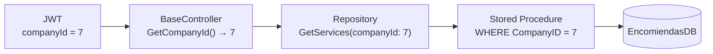

ServiciosYa API enforces a strict five-level role hierarchy that controls what each user can see and do within the platform. Every user also belongs to exactly one company, identified by a `CompanyID` stored directly in their JWT token. Most database queries automatically filter by that `CompanyID`, keeping data isolated between tenants without requiring any extra parameter from the client. `SUPER_ADMIN` is the only role that operates above company boundaries.

## The five roles

<CardGroup cols={1}>
  <Card title="SUPER_ADMIN" icon="shield-halved">
    Global platform access. Can create users of any role, manage all companies, and perform every operation across the entire system including service deletion and service request deletion. Not bound to a single company.
  </Card>
  <Card title="ADMIN_GENERAL" icon="building">
    Administrative access scoped to their own company. Can create `GESTOR_SUPREMO`, `GESTOR`, and `CUSTOMER` users. Can create, edit, activate, deactivate, and logically delete services within their company. Can view, validate payments, and change status on service requests. Cannot delete service requests.
  </Card>
  <Card title="GESTOR_SUPREMO" icon="star">
    Services module lead within their company. Can create `GESTOR` and `CUSTOMER` users. Can create, edit, activate, deactivate, and logically delete services. Can view service requests, validate payments, and change certain statuses.
  </Card>
  <Card title="GESTOR" icon="user-tie">
    Operational internal user. Can create `CUSTOMER` users. Can view service requests and confirm refunds. Service management operations (create, delete, edit) are not available to this role in the current API version.
  </Card>
  <Card title="CUSTOMER" icon="user">
    End user. Self-registers through the public registration endpoint (assigned to company 1). Can browse active services, create service requests with payment proof, view their own requests, and cancel a request that is still in `SOLICITADO` state.
  </Card>
</CardGroup>

## Role capability matrix

The table below summarises what each role can do across the main resource groups.

| Capability | SUPER_ADMIN | ADMIN_GENERAL | GESTOR_SUPREMO | GESTOR | CUSTOMER |
|---|:---:|:---:|:---:|:---:|:---:|
| Create `ADMIN_GENERAL` | ✅ | ❌ | ❌ | ❌ | ❌ |
| Create `GESTOR_SUPREMO` | ✅ | ✅ | ❌ | ❌ | ❌ |
| Create `GESTOR` | ✅ | ✅ | ✅ | ❌ | ❌ |
| Create `CUSTOMER` (internal) | ✅ | ✅ | ✅ | ✅ | ❌ |
| Public self-registration | — | — | — | — | ✅ |
| List / view users | ✅ | ✅ | ✅ | ✅ | ❌ |
| Toggle user active/inactive | ✅ | ✅ | ✅ | ✅ | ❌ |
| List all companies | ✅ | ❌ | ❌ | ❌ | ❌ |
| Create / edit services | ✅ | ✅ | ✅ | ❌ | ❌ |
| Activate / deactivate services | ✅ | ✅ | ✅ | ❌ | ❌ |
| Delete services (logical) | ✅ | ✅ | ✅ | ❌ | ❌ |
| View service catalogue | ✅ | ✅ | ✅ | — | ✅ |
| Create service request | ✅ | ✅ | ✅ | ✅ | ✅ |
| View all service requests (admin) | ✅ | ✅ | ✅ | ❌ | ❌ |
| View own service requests | ✅ | ✅ | ✅ | ✅ | ✅ |
| Validate / reject payment | ✅ | ✅ | ✅ | ❌ | ❌ |
| Change service request status | ✅ | ✅ | ✅ | ❌ | ✅ (cancel own) |
| Confirm refund | ✅ | ✅ | ✅ | ✅ | ❌ |
| Delete service request | ✅ | ❌ | ❌ | ❌ | ❌ |

<Note>
  Service deletion is **logical only** — records are flagged `IsDeleted = true` and hidden from queries but not removed from the database. Only `SUPER_ADMIN` can permanently destroy service requests, and even then the operation removes the record from the application's visible scope.
</Note>

## Internal user creation hierarchy

When an internal user is created via `POST /api/auth/register/internal`, the API enforces that the caller can only assign a role equal to or below their own in the hierarchy. The table below maps each caller role to the roles they are permitted to assign.

| Caller role | Roles the caller can create |
|---|---|
| `SUPER_ADMIN` | `ADMIN_GENERAL`, `GESTOR_SUPREMO`, `GESTOR`, `CUSTOMER` |
| `ADMIN_GENERAL` | `GESTOR_SUPREMO`, `GESTOR`, `CUSTOMER` |
| `GESTOR_SUPREMO` | `GESTOR`, `CUSTOMER` |
| `GESTOR` | `CUSTOMER` |

Every internally created user receives an initial password of `123456` and has `MustChangePassword = true` set, forcing a password change on first login.

## Multi-tenancy: CompanyID isolation

Every user record carries a `CompanyID` foreign key. When `JwtService` issues a token, it embeds that value as the `companyId` claim:

```csharp
var claims = new[]
{
    new Claim("userId",    user.UserID.ToString()),
    new Claim("companyId", user.CompanyID.ToString()),
    new Claim(ClaimTypes.Role, user.Role.ToUpper())
};
```

Controllers extract the value with `GetCompanyId()` from `BaseController` and pass it to every repository call. Stored procedures use it as a mandatory filter parameter, so a user from Company A can never read or modify data belonging to Company B — even if they guess the correct record IDs.



<Warning>
  Because `CompanyID` is embedded in the token at login time, changing a user's company in the database does not take effect until the user's current token expires and they log in again.
</Warning>

## Public registration and company assignment

The public registration endpoint (`POST /api/auth/register`) is available without authentication and always creates a `CUSTOMER` user. The company assignment rules are:

- **Public registration** → user is assigned `CompanyID = 1`, the base ServiciosYa company.
- **Internal registration** → user inherits the `CompanyID` of the creating user (read from their token), with one exception: `SUPER_ADMIN` can specify any `CompanyID` when creating users.

This ensures that customers who register through the MAUI app or a public web form land in the base company and are immediately able to browse its service catalogue and submit requests.

## Service categories

Services are organised into a fixed set of categories defined in `ServiceCategories`. These categories are used for the `/api/services/by-category` endpoint and service creation:

| Category constant | Display value |
|---|---|
| `EscribaniaLegales` | Escribania y legales |
| `PresentacionDocumentos` | Presentacion de documentos |
| `PagoImpuestosPatentes` | Pago de impuestos, patentes y otros |
| `TraduccionesLegales` | Traducciones legales |
| `Delivery` | Delivery |
| `Otros` | Otros |

<Tip>
  Category values are normalised on the API side before persistence — common aliases like `"LEGALES"` or `"DOCUMENTOS"` are accepted and mapped to the canonical display name. If an unrecognised category is submitted, the API returns HTTP `400` with `"Categoria invalida. Usa una categoria permitida."`.
</Tip>
